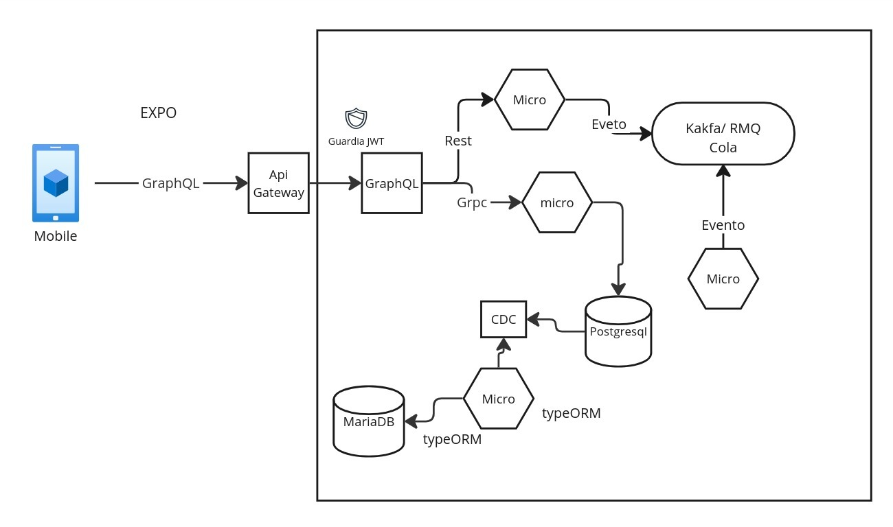

# Proyecto Final - Grupo 4

## Arquitectura de Integración



Este proyecto implementa una arquitectura de integración basada en microservicios y patrones de comunicación asincrónica utilizando tecnologías como **Kong API Gateway, Apache Kafka, Shared Database y Remote Procedure Invocation (RPC)**.

## 📌 Pasos para la Ejecución
1. Levantar los contenedores con Docker Compose:
   ```sh
   docker-compose up -d
   ```
2. Verificar los logs de los contenedores para asegurarse de que los servicios están funcionando correctamente:
   ```sh
   docker ps
   ```
3. Para detener los servicios, ejecutar:
   ```sh
   docker-compose down
   ```

## 📌 Tareas del Proyecto Final

### 📝 Task_2: Informe y Ejemplo de Uso - Kong API Gateway
- **Objetivo**: Elaborar un informe detallado sobre el uso de **Kong API Gateway**, explicando su importancia en la arquitectura de integración y proporcionando un ejemplo práctico de su implementación.
- **Ejemplo práctico**: Configuración de un servicio con Kong para gestionar el acceso a microservicios y aplicar reglas de autenticación.

### 📝 Task_3: Informe y Ejemplo de Uso - Integración con Apache Kafka
- **Objetivo**: Documentar cómo se integra **Apache Kafka** en el sistema y presentar un ejemplo práctico.
- **Ejemplo práctico**: Implementación de un **producer** y un **consumer** que intercambian mensajes mediante Kafka.
- **Ver logs** del producer y consumer:
   ```sh
   docker logs consumer_app --follow
   docker logs producer_app --follow
   ```

### 📝 Task_5: Informe y Ejemplo de Uso - Shared Database
- **Objetivo**: Analizar el uso de una **base de datos compartida** en una arquitectura distribuida y documentar sus ventajas y desventajas.
- **Ejemplo práctico**: Implementar una base de datos centralizada accesible por varios microservicios.

### 📝 Task_6: Informe y Ejemplo de Uso - Remote Procedure Invocation (RPC)
- **Objetivo**: Explicar el uso de **RPC** en la comunicación entre microservicios y demostrar su implementación en el proyecto.
- **Ejemplo práctico**: Configurar una comunicación RPC entre dos servicios utilizando gRPC o HTTP.

### 📝 Task_7: Informe y Ejemplo de Uso - Filtros en la Aplicación
- **Objetivo**: Documentar cómo funcionan los **filtros** en la aplicación para controlar y modificar el tráfico de datos.
- **Ejemplo práctico**: Implementación de filtros en **Kong API Gateway** para restringir el acceso a ciertos endpoints según reglas específicas.

## 📌 Conclusión
Este proyecto busca explorar diferentes estrategias de integración en arquitecturas distribuidas utilizando tecnologías modernas. La combinación de **API Gateway, mensajería con Kafka, bases de datos compartidas y RPC** permite crear sistemas robustos, escalables y eficientes.

Para más detalles, consulta la documentación de cada tecnología:
- **Kong API Gateway**: [https://docs.konghq.com/](https://docs.konghq.com/)
- **Apache Kafka**: [https://kafka.apache.org/documentation/](https://kafka.apache.org/documentation/)
- **Docker**: [https://docs.docker.com/](https://docs.docker.com/)
- **gRPC**: [https://grpc.io/docs/](https://grpc.io/docs/)

